# AI Integration Diagrams

## 1. AI Integration Data Flow - Review CV Action

---

## 2. Complete System Architecture

---

## 3. All 4 AI Methods and Their Flows

```mermaid
graph TD
    CVE["CVEditorComponent<br/>cv-editor.component.ts"]

    CVE -->|Method 1| REV["reviewCV()"]
    CVE -->|Method 2| IMP["improveCV()"]
    CVE -->|Method 3| TAI["tailorCV()"]
    CVE -->|Method 4| GEN["generateQuestions()"]

    REV -->|1. Validate form| REV1["✓ Form valid"]
    REV1 -->|2. Build CV| REV2["buildParsedCV()"]
    REV2 -->|3. Call service| REV3["aiService.reviewCV"]
    REV3 -->|4. HTTP POST| REV4["/api/cv/review"]
    REV4 -->|5. Get feedback| REV5["Display Issues<br/>& Recommendations"]

    IMP -->|1. Validate form| IMP1["✓ Form valid"]
    IMP1 -->|2. Build CV| IMP2["buildParsedCV()"]
    IMP2 -->|3. Call service| IMP3["aiService.improveCV"]
    IMP3 -->|4. HTTP POST| IMP4["/api/cv/improve"]
    IMP4 -->|5. Auto-update| IMP5["updateFormWithCV()<br/>Form fields updated"]

    TAI -->|1. Validate form| TAI1["✓ Form valid"]
    TAI1 -->|2. Check job desc| TAI2["✓ Job description entered"]
    TAI2 -->|3. Build CV| TAI3["buildParsedCV()"]
    TAI3 -->|4. Call service| TAI4["aiService.tailorCVForJob"]
    TAI4 -->|5. HTTP POST| TAI5["/api/cv/tailor<br/>+ jobBrief"]
    TAI5 -->|6. Auto-update| TAI6["updateFormWithCV()<br/>Form reordered by relevance"]

    GEN -->|1. Validate form| GEN1["✓ Form valid"]
    GEN1 -->|2. Check job desc| GEN2["✓ Job description entered"]
    GEN2 -->|3. Build CV| GEN3["buildParsedCV()"]
    GEN3 -->|4. Call service| GEN4["aiService.generateInterviewQ"]
    GEN4 -->|5. HTTP POST| GEN5["/api/cv/generate-questions<br/>+ jobBrief"]
    GEN5 -->|6. Display| GEN6["Show 5-7 Questions<br/>in aiMessage"]

    style CVE fill:#ec4899,color:#fff
    style REV fill:#3b82f6,color:#fff
    style IMP fill:#3b82f6,color:#fff
    style TAI fill:#3b82f6,color:#fff
    style GEN fill:#3b82f6,color:#fff
    style REV5 fill:#10b981,color:#fff
    style IMP5 fill:#10b981,color:#fff
    style TAI6 fill:#10b981,color:#fff
    style GEN6 fill:#10b981,color:#fff
```

---

## How to View These Diagrams

### Option 1: View in GitHub

If you push this file to GitHub, the mermaid diagrams will render automatically.

### Option 2: View Locally

Use a markdown viewer that supports mermaid (VS Code with mermaid extension, Obsidian, etc.)

### Option 3: Convert to PNG/SVG

Use [Mermaid Live Editor](https://mermaid.live/) to paste these diagrams and export as images.

---

## Diagram Summaries

### Diagram 1: Data Flow

Shows the complete request/response cycle for a single AI action (Review CV)

- User interaction → Component method → Service call → Backend → Claude → Response → Display

### Diagram 2: System Architecture

Shows all 3 layers and how components connect:

- Frontend (Angular components & services)
- Backend (Express routes & Claude service)
- Database (MySQL)

### Diagram 3: All 4 AI Methods

Shows the parallel flows for each of the 4 AI actions:

- Review CV (display feedback)
- Improve CV (auto-update form)
- Tailor CV (auto-update + reorder)
- Interview Questions (display results)
